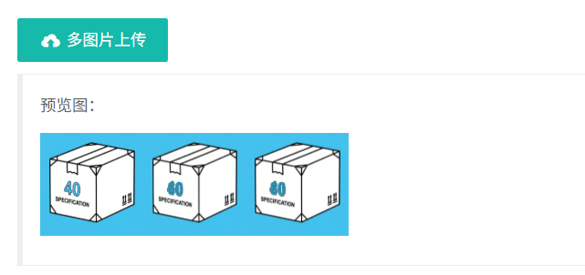
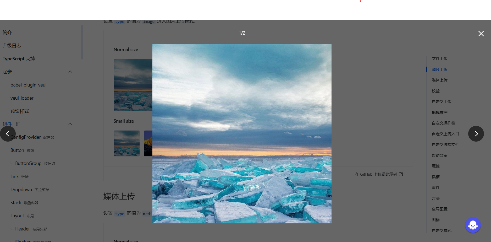

# 🧾 订单凭证需求

- 紧急度：优先
- 功能描述：在订单列表页面上传凭证（支持多个）

# 📌 功能说明

## 文件校验要求
- 文件大小不得超过 2MB
- 支持上传图片格式为：png、jpeg、jpg 等常见格式
- 需校验 MIME 类型，不能仅依赖文件后缀判断文件类型
- 对于 PDF 文件，可上传但无需预览内容
- 若上传失败，必须提示明确错误原因，
    - 如：“当前图片 3MB，已超出最大上传限制 2MB”

## 上传者信息
- 每张凭证需标识上传者的姓名（仅仓库管理端展示）
- 客户查看时不展示上传者姓名

## 其他
- 点击每张图片需要支持放大至原始尺寸展示

## 参考效果

在订单列表中新增一列 “上传凭证” 按钮，点击该按钮后可针对当前行数据上传凭证，支持多个附件。

点击“上传凭证”按钮后，弹出一个浮动弹窗，实现下方图示的多图上传功能（UI 参考即可，功能一致即可）

上传后每张凭证图片应展示上传者信息

点击任意图片，应支持放大至原始尺寸展示。

# 客户查询入口

## 客户账号登录 OMS 后查看凭证
- 可查看对应订单的所有已上传凭证
- 无需展示上传者姓名
- 每张凭证需展示 上传时间（格式：YYYY-MM-DD），展示效果可参考上传者name的效果
- 点击图片展示效果与仓库管理侧一致

## 上传后需调用客户接口进行推送
- 上传凭证后，需调用客户方提供的数据接口，Push 凭证信息
- 需要调研客户接口支持情况：
- 是否支持一次上传多个附件？
- 是否允许多次上传？是否支持覆盖已上传的凭证？