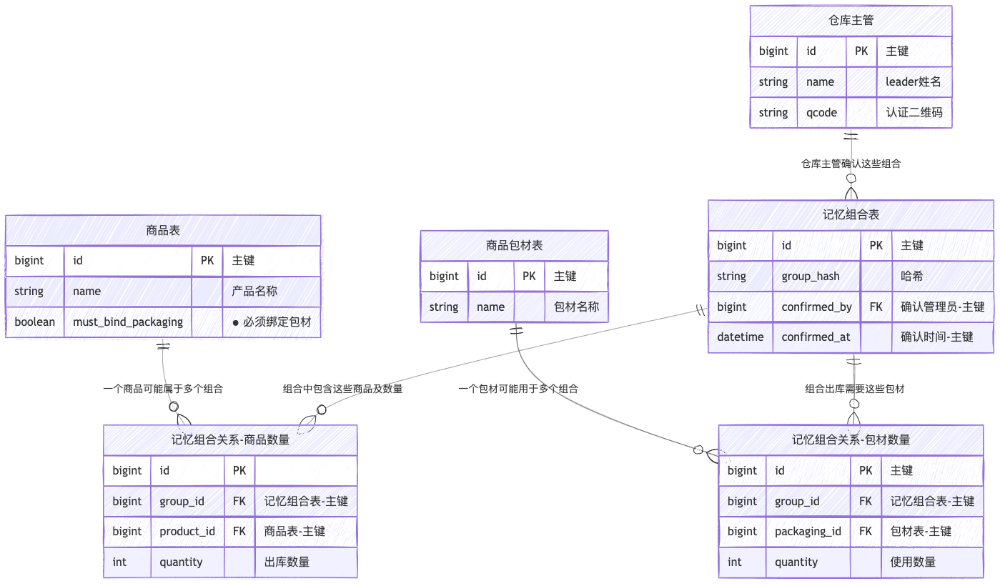

# 产品需求文档(PRD)

## 1. 文档信息

文档版本：v1.0
编写人：森山洸生
创建时间：2025-05-28
最近更新：2025-06-11

## 2. 背景与目的

### 背景

当前出库面单打印程序潜在问题，功能相似却分布在不同的页面，需要切换使用，产品和包材没有相关性，货运渠道和产品出库包裹也没有形成绑定关系

### 目的

调整 UI 界面，增补部分功能，实现订单信息与快递单自动匹配，快速打印，并可接入多家快递接口，实现标准化、自动化的出库流程。

## 3. 项目目标

- 实现订单打印和扫码出库的功能整合
- 出库时可以动态分包裹
- 出库时选择包材可以和商品组合形成绑定记忆功能
- 尺寸和出库包裹内商品组合形成绑定记忆功能
- 增加增值服务功能
- 商品和包材实现出库记忆更新功能
- 商品组合包裹实现尺寸记忆更新功能

### 对应的任务 LIST

- 出库扫描系统 UI 最大化，界面展示优化（UI适配）
- 系统需要支持黑猫和佐川的子母复数订单
- 出库扫描系统，扫描各种单号（逻辑业务）
- 增加增值业务模块，从包材模块分离出（现有功能调整）
- 出库扫描系统多个出库模块需要整合成一个页面（UI适配）
- 商品与包材的复数绑定组合（逻辑业务）
- 尺寸规则（逻辑业务）

## 4. 角色与场景

> 涉及需要调整的相关业务

| 角色           | 使用场景           |
| -------------- | ------------------ |
| 仓库操作员     | 出库打印程序       |
| 管理员（财务） | 包材管理，增值管理 |
| 客户端（用户）  | 暂无               |

## 5. 功能需求

### 5.1. 整合面单打印（订单出库和商品）

#### 5.1.1. 条码扫描功能：需要支持以下扫码种类

- SKU 码（商品品类）
- 商品 SN 码（产品唯一）
- 商品码 （PR）
- 订单号（OR）
- 批次码 (BH)
- 包材码
- 增值码
- 尺寸码

#### 5.1.2. 扫码逻辑

① 扫描订单 - 判断订单 CODE 是否存在未出库订单 LIST 中

- 不存在，提示异常消息
- 存在，在商品 LIST 区域加载所有商品品类

② 扫描【SKU 码/商品 SN 码/商品码】之一，查询所有未出库订单 LIST 中含有当前扫描的 CODE

- 不存在，提示异常消息
- 存在
  - 如果可以锁定到唯一未出库订单，则数据加载逻辑同　 ①
  - 如果查询结果有多个未出库订单
    - 根据最小可出库商品种类原则获取唯一订单，则数据加载逻辑同 ①
    - 如果依然存在 1 个以上的订单，则把匹配到的订单中除已扫的商品外的其他商品名称以 LIST 表的形式提示用户需要扫以下的商品之一
    - 如果存在 1 个以上订单内商品品类完全一致的情况则根据订单生成日期时间先进先出原则
    - 如果存在 1 个以上订单内商品品类和订单日期时间完全一致的情况则随机其中一个订单即可

> 商品扫描业务流程图


> 伪代码

`数据结构`
```python
# ----------------------------------------------------
# 1. 数据结构 (Data Structures)
# ----------------------------------------------------
@dataclass
class Product:
    name: str
    sku: str
    product_code: str
    sn_list: List[str]

@dataclass
class OrderItem:
    product: Product
    quantity: int
    scanned_sn: List[str] = field(default_factory=list)

@dataclass
class Order:
    order_code: str
    items: List[OrderItem]
    creation_date: datetime
    status: str = "awaiting_shipment"

```

`未出库订单列表`
```python
# ----------------------------------------------------
# 2. 模拟的未出库订单列表 (Mock Data)
# ----------------------------------------------------
PRODUCT_A = Product(name="高配版笔记本电脑", sku="SKU-NB-HIGH", product_code="P-NB-01", sn_list=["SN-NB-001", "SN-NB-002"])
PRODUCT_B = Product(name="无线鼠标", sku="SKU-MOUSE-WL", product_code="P-MS-01", sn_list=["SN-MS-101", "SN-MS-102"])
PRODUCT_C = Product(name="机械键盘", sku="SKU-KB-MECH", product_code="P-KB-01", sn_list=["SN-KB-201", "SN-KB-202"])
PRODUCT_D = Product(name="高清显示器", sku="SKU-DISP-HD", product_code="P-DP-01", sn_list=["SN-DP-301"])

UNSHIPPED_ORDERS_LIST = [
    Order(order_code="ORD-2023-001", items=[OrderItem(product=PRODUCT_A, quantity=1)], creation_date=datetime(2023, 10, 26, 10, 0, 0)),
    Order(order_code="ORD-2023-002", items=[OrderItem(product=PRODUCT_A, quantity=1), OrderItem(product=PRODUCT_B, quantity=1)], creation_date=datetime(2023, 10, 26, 11, 0, 0)),
    Order(order_code="ORD-2023-003", items=[OrderItem(product=PRODUCT_A, quantity=1), OrderItem(product=PRODUCT_B, quantity=1), OrderItem(product=PRODUCT_C, quantity=1)], creation_date=datetime(2023, 10, 26, 12, 0, 0)),
    Order(order_code="ORD-2023-004", items=[OrderItem(product=PRODUCT_C, quantity=1), OrderItem(product=PRODUCT_D, quantity=1)], creation_date=datetime(2023, 10, 26, 13, 0, 0)),
    Order(order_code="ORD-2023-005", items=[OrderItem(product=PRODUCT_C, quantity=1), OrderItem(product=PRODUCT_D, quantity=1)], creation_date=datetime(2023, 10, 26, 14, 0, 0)),
    Order(order_code="ORD-2023-006", items=[OrderItem(product=PRODUCT_C, quantity=1), OrderItem(product=PRODUCT_D, quantity=1)], creation_date=datetime(2023, 10, 26, 14, 0, 0)),
]
```
`核心功能函数`
```python
# ----------------------------------------------------
# 3. 核心功能函数 (Core Logic Functions)
# ----------------------------------------------------
current_session_order: Optional[Order] = None

def display_order_details(order: Order):
    """加载并显示订单的商品信息"""
    global current_session_order
    current_session_order = order
    print(f"\n✅ 成功锁定订单: {order.order_code} (创建于: {order.creation_date})")
    print("   包含以下商品:")
    for item in order.items:
        print(f"   - {item.product.name} (SKU: {item.product.sku}) x {item.quantity}")

def process_order_code_scan(order_code: str):
    """处理订单号扫描"""
    print(f"\n[操作] 扫描订单号: {order_code}")
    found_order = next((o for o in UNSHIPPED_ORDERS_LIST if o.order_code == order_code), None)
    if found_order:
        display_order_details(found_order)
    else:
        print(f"❌ 异常：订单号 {order_code} 不存在或已出库。")

def process_product_scan(scanned_code: str):
    """处理商品码扫描"""
    print(f"\n[操作] 扫描商品码/SN/SKU: {scanned_code}")

    candidate_orders = [
        order for order in UNSHIPPED_ORDERS_LIST
        if any(
            scanned_code == item.product.sku or
            scanned_code == item.product.product_code or
            scanned_code in item.product.sn_list
            for item in order.items
        )
    ]
    
    if not candidate_orders:
        print(f"❌ 异常：在未出库订单中未找到含 {scanned_code} 的商品。")
        return

    if len(candidate_orders) == 1:
        print("锁定到唯一订单。")
        display_order_details(candidate_orders[0])
        return

    print(f"发现 {len(candidate_orders)} 个可能订单，应用筛选规则...")
    
    # 规则 A: 最小可出库商品种类
    min_item_types = min(len(order.items) for order in candidate_orders)
    filtered_orders = [o for o in candidate_orders if len(o.items) == min_item_types]
    print(f"   规则[最小商品种类]: 筛选后剩下 {len(filtered_orders)} 个订单。")

    if len(filtered_orders) == 1:
        display_order_details(filtered_orders[0])
        return

    # 规则 B, C, D
    order_signatures = {}
    for order in filtered_orders:
        signature = tuple(sorted([item.product.sku for item in order.items]))
        if signature not in order_signatures:
            order_signatures[signature] = []
        order_signatures[signature].append(order)

    if len(order_signatures) == 1:
        print("   规则[品类一致]: 所有候选订单品类一致，应用先进先出原则。")
        identical_orders = list(order_signatures.values())[0]
        identical_orders.sort(key=lambda o: o.creation_date)
        
        oldest_order = identical_orders[0]
        final_candidates = [o for o in identical_orders if o.creation_date == oldest_order.creation_date]

        if len(final_candidates) == 1:
            print("   规则[先进先出]: 成功锁定最早的订单。")
            display_order_details(final_candidates[0])
        else:
            print("   规则[时间相同]: 存在多个时间完全相同的最早订单，随机选择一个。")
            chosen_order = random.choice(final_candidates)
            display_order_details(chosen_order)
        return
    else:
        print("   规则[品类不同]: 存在多个品类不同的订单，需要进一步扫描。")
        other_items_to_scan: Set[str] = set()
        for order in filtered_orders:
            for item in order.items:
                product = item.product
                if not (scanned_code == product.sku or scanned_code == product.product_code or scanned_code in product.sn_list):
                    other_items_to_scan.add(f"{product.name} (SKU: {product.sku})")
        
        print("\n下一步操作建议：")
        print("请扫描以下商品之一以确定唯一订单:")
        for item_name in sorted(list(other_items_to_scan)):
            print(f"- {item_name}")
```
`主流程模拟`
```python
# ----------------------------------------------------
# 4. 主流程模拟 (Main Simulation)
# ----------------------------------------------------
def main():
    """模拟扫描流程"""
    print("--- 场景1: 扫描一个不存在的订单号 ---")
    process_order_code_scan("ORD-NON-EXIST")

    print("\n" + "="*40)
    print("--- 场景2: 扫描一个存在的订单号 (直接锁定) ---")
    process_order_code_scan("ORD-2023-001")
    
    print("\n" + "="*40)
    print("--- 场景3: 扫描一个商品码，通过“最小商品种类”规则唯一确定订单 ---")
    process_product_scan("SKU-NB-HIGH")

    print("\n" + "="*40)
    print("--- 场景4: 扫描商品码，匹配到多个品类不同的订单，提示用户 ---")
    print("(临时修改数据以触发此场景)")
    original_item = UNSHIPPED_ORDERS_LIST[2].items.pop() # 从ORD-003中移除键盘，使其也为2种商品
    process_product_scan("SKU-MOUSE-WL")
    UNSHIPPED_ORDERS_LIST[2].items.append(original_item) # 恢复数据

    print("\n" + "="*40)
    print("--- 场景5: 扫描商品，通过“先进先出”规则确定订单 ---")
    process_product_scan("SKU-KB-MECH")

    print("\n" + "="*40)
    print("--- 场景6: 扫描商品，通过“随机选择”规则确定订单 ---")
    print("(临时移除ORD-004以触发此场景)")
    temp_order = UNSHIPPED_ORDERS_LIST.pop(3) # 移除 ORD-004
    process_product_scan("SKU-DISP-HD")
    UNSHIPPED_ORDERS_LIST.insert(3, temp_order) # 恢复数据
```

`期望结果`
```bash
--- 场景1: 扫描一个不存在的订单号 ---

[操作] 扫描订单号: ORD-NON-EXIST
❌ 异常：订单号 ORD-NON-EXIST 不存在或已出库。

========================================
--- 场景2: 扫描一个存在的订单号 (直接锁定) ---

[操作] 扫描订单号: ORD-2023-001

✅ 成功锁定订单: ORD-2023-001 (创建于: 2023-10-26 10:00:00)
   包含以下商品:
   - 高配版笔记本电脑 (SKU: SKU-NB-HIGH) x 1

========================================
--- 场景3: 扫描一个商品码，通过“最小商品种类”规则唯一确定订单 ---

[操作] 扫描商品码/SN/SKU: SKU-NB-HIGH
发现 3 个可能订单，应用筛选规则...
   规则[最小商品种类]: 筛选后剩下 1 个订单。

✅ 成功锁定订单: ORD-2023-001 (创建于: 2023-10-26 10:00:00)
   包含以下商品:
   - 高配版笔记本电脑 (SKU: SKU-NB-HIGH) x 1

========================================
--- 场景4: 扫描商品码，匹配到多个品类不同的订单，提示用户 ---
(临时修改数据以触发此场景)

[操作] 扫描商品码/SN/SKU: SKU-MOUSE-WL
发现 2 个可能订单，应用筛选规则...
   规则[最小商品种类]: 筛选后剩下 2 个订单。
   规则[品类不同]: 存在多个品类不同的订单，需要进一步扫描。

下一步操作建议：
请扫描以下商品之一以确定唯一订单:
- 高配版笔记本电脑 (SKU: SKU-NB-HIGH)

========================================
--- 场景5: 扫描商品，通过“先进先出”规则确定订单 ---

[操作] 扫描商品码/SN/SKU: SKU-KB-MECH
发现 4 个可能订单，应用筛选规则...
   规则[最小商品种类]: 筛选后剩下 3 个订单。
   规则[品类一致]: 所有候选订单品类一致，应用先进先出原则。
   规则[先进先出]: 成功锁定最早的订单。

✅ 成功锁定订单: ORD-2023-004 (创建于: 2023-10-26 13:00:00)
   包含以下商品:
   - 机械键盘 (SKU: SKU-KB-MECH) x 1
   - 高清显示器 (SKU: SKU-DISP-HD) x 1

========================================
--- 场景6: 扫描商品，通过“随机选择”规则确定订单 ---
(临时移除ORD-004以触发此场景)

[操作] 扫描商品码/SN/SKU: SKU-DISP-HD
发现 2 个可能订单，应用筛选规则...
   规则[最小商品种类]: 筛选后剩下 2 个订单。
   规则[品类一致]: 所有候选订单品类一致，应用先进先出原则。
   规则[时间相同]: 存在多个时间完全相同的最早订单，随机选择一个。

✅ 成功锁定订单: ORD-2023-005 (创建于: 2023-10-26 14:00:00)
   包含以下商品:
   - 机械键盘 (SKU: SKU-KB-MECH) x 1
   - 高清显示器 (SKU: SKU-DISP-HD) x 1
```
---
`结果分析`
- 场景1 & 2：正确处理了订单号扫描的两种基本情况（存在与不存在）。
- 场景3：扫描笔记本电脑（SKU-NB-HIGH），它存在于订单 1, 2, 3中。根据“最小商品种类”规则，订单1（只有1种商品）被选中，符合预期。
- 场景4：扫描无线鼠标（SKU-MOUSE-WL）。为了测试，我们临时修改了数据，使得订单2和订单3都包含2种商品。由于它们的商品品类不同（一个有笔记本，一个有键盘），系统无法确定唯一订单，并提示用户扫描另一个商品来区分。符合预期。
- 场景5：扫描机械键盘（SKU-KB-MECH）。它存在于订单 3, 4, 5, 6中。
“最小商品种类”规则排除了订单3（3种商品），剩下订单 4, 5, 6（都是2种商品）。
订单 4, 5, 6 的商品品类完全一致（键盘+显示器）。
应用“先进先出”，订单4（13:00）比订单5和6（14:00）更早，因此被选中。符合预期。
- 场景6：扫描高清显示器（SKU-DISP-HD）。为了测试，我们临时移除了最早的订单4。
现在只剩下订单 5 和 6。它们商品种类数相同，品类也相同。
它们的创建时间也完全相同（14:00）。
触发“随机选择”规则，从两者中任选一个。符合预期。


#### 5.1.3 包材记忆逻辑

> 如果订单中的商品存在必须包材的品类，强制操作员必须扫描包材，如果没有扫描，当前订单只能做跳过处理，不可进行出库。当扫描的商品和包材进行初次绑定的时候，需要操作员的管理者进行确认（扫描管理人员的识别码确认这个操作有效）。当记忆过的商品组合出库的时候，自动标识出应要扫描的包材种类和数量，如果操作员扫描的种类和数量不符合记忆数据，则需要扫描管理者的确认码确认操作有效，确认后将新的组合覆盖掉旧的记忆

##### 5.1.3.1 强制包材扫描逻辑

- 若订单中的商品中存在需要指定包材的品类：
  - 系统必须提示：强制要求扫描包材条码
  - 若操作员未扫描包材：
    - 禁止继续出库操作
    - 当前订单出库跳过

##### 5.1.3.2 商品与包材的首次绑定流程

- 当商品与某种包材是 **首次绑定（即无历史记录）** ：
  - 操作员在系统中扫描商品和包材
  - 必须由其直属管理者进行确认：
    - 管理者需扫描或输入其 身份识别码（如工号）
    - 扫描识别码系统验证后，记忆生效
  - 商品-包材组合存入记忆库

##### 5.1.3.3 记忆组合出库流程

- 当系统识别该商品出库 **历史中存在已记忆的包材组合** ：
  - 系统自动提示应配套的包材种类与数量
  - 操作员按提示扫描包材条码
  - 系统进行验证：
    - 如果扫描包材与记忆组合完全匹配 → 正常出库
    - 如果不一致（种类或数量）
      - 系统提示需管理者介入
      - 管理者需扫描/输入其识别码以确认此次新组合
      - 确认后，系统将新组合覆盖旧组合，用于后续记忆

> 流程图


> 伪代码

`数据结构和模拟数据`
```python
@dataclass
class Package:
    """包材类"""
    name: str
    package_code: str  # 用于扫描的包材条码

@dataclass
class Product:
    """商品类，增加'requires_packaging'字段"""
    name: str
    sku: str
    product_code: str
    sn_list: List[str]
    requires_packaging: bool = False # 默认为False

# OrderItem 和 Order 类保持不变...
@dataclass
class OrderItem:
    product: Product
    quantity: int

@dataclass
class Order:
    order_code: str
    items: List[OrderItem]
    creation_date: datetime
    status: str = "awaiting_shipment"


# --- 模拟数据库和初始数据 ---

# 商品 (部分商品需要强制包材)
PRODUCT_A = Product(name="高配版笔记本电脑", sku="SKU-NB-HIGH", product_code="P-NB-01", sn_list=[], requires_packaging=True)
PRODUCT_B = Product(name="无线鼠标", sku="SKU-MOUSE-WL", product_code="P-MS-01", sn_list=[], requires_packaging=False)
PRODUCT_C = Product(name="易碎品显示器", sku="SKU-DISP-FRAGILE", product_code="P-DP-02", sn_list=[], requires_packaging=True)
PRODUCT_D = Product(name="普通键盘", sku="SKU-KB-STD", product_code="P-KB-02", sn_list=[])

# 包材
PACKAGE_S = Package(name="小号防震纸箱", package_code="PKG-S")
PACKAGE_M = Package(name="中号防震纸箱", package_code="PKG-M")
PACKAGE_L = Package(name="大号加固木箱", package_code="PKG-L")
ALL_PACKAGES = {p.package_code: p for p in [PACKAGE_S, PACKAGE_M, PACKAGE_L]}

# 管理员识别码
VALID_MANAGER_IDS = {"MGR-001", "MGR-007"}

# 包材记忆数据库 (核心)
# 键: 排序后的商品SKU元组, 值: Package对象
PACKAGE_MEMORY_DB: Dict[Tuple[str, ...], Package] = {}

# 模拟订单
ORDER_1 = Order(order_code="ORD-PACK-001", items=[OrderItem(PRODUCT_B, 1), OrderItem(PRODUCT_D, 1)], creation_date=datetime.now()) # 无需强制包材
ORDER_2 = Order(order_code="ORD-PACK-002", items=[OrderItem(PRODUCT_A, 1)], creation_date=datetime.now()) # 首次绑定
ORDER_3 = Order(order_code="ORD-PACK-003", items=[OrderItem(PRODUCT_A, 1)], creation_date=datetime.now()) # 用于测试记忆
ORDER_4 = Order(order_code="ORD-PACK-004", items=[OrderItem(PRODUCT_A, 1), OrderItem(PRODUCT_C, 1)], creation_date=datetime.now()) # 复杂组合
```
`包材处理逻辑`
```python
def process_packaging(order: Order, get_input):
    """
    处理已锁定订单的包材扫描和记忆逻辑
    :param order: 已锁定的订单对象
    :param get_input: 一个用于模拟用户输入的函数
    :return: "success", "skipped", "failed"
    """
    print(f"\n--- 开始处理订单 {order.order_code} 的包材流程 ---")

    # 1. 判断是否需要强制包材
    if not any(item.product.requires_packaging for item in order.items):
        print("✅ 此订单商品无需强制包材。流程结束。")
        return "success"

    print("❗️ 此订单包含需要强制包材的商品。")

    # 为商品组合创建唯一签名 (key)
    product_signature = tuple(sorted([item.product.sku for item in order.items]))

    # 主循环，直到成功或跳过
    while True:
        # 2. 检查是否存在记忆
        if product_signature in PACKAGE_MEMORY_DB:
            # --- 场景A: 存在记忆 ---
            expected_package = PACKAGE_MEMORY_DB[product_signature]
            print(f"📦 系统记忆建议使用: 【{expected_package.name} ({expected_package.package_code})】")
            print("请扫描包材码 (或输入 'skip' 跳过):")
            scanned_code = get_input()

            if scanned_code.lower() == 'skip':
                print("⏭️ 用户选择跳过当前订单。")
                return "skipped"

            if scanned_code == expected_package.package_code:
                print("✅ 包材匹配成功！")
                return "success"
            else:
                # --- 扫描包材与记忆不符 ---
                if scanned_code not in ALL_PACKAGES:
                    print(f"❌ 错误：扫描的包材码 '{scanned_code}' 无效，请重试。")
                    continue # 返回循环开头，重新扫描

                print(f"⚠️ 扫描的包材与记忆不符！需要主管确认以更新记忆。")
                print("请扫描主管识别码:")
                manager_id = get_input()

                if manager_id in VALID_MANAGER_IDS:
                    new_package = ALL_PACKAGES[scanned_code]
                    PACKAGE_MEMORY_DB[product_signature] = new_package
                    print(f"🔑 主管确认成功！记忆已更新为: 【{new_package.name}】")
                    return "success"
                else:
                    print("❌ 主管验证失败！操作取消，请重新扫描包材。")
                    continue # 返回循环开头
        else:
            # --- 场景B: 首次绑定 ---
            print("📖 这是一个新的商品组合，需要进行首次包材绑定。")
            print("请扫描包材码 (或输入 'skip' 跳过):")
            scanned_code = get_input()

            if scanned_code.lower() == 'skip':
                print("⏭️ 用户选择跳过当前订单。")
                return "skipped"

            if scanned_code not in ALL_PACKAGES:
                print(f"❌ 错误：扫描的包材码 '{scanned_code}' 无效，请重试。")
                continue

            print("🔑 首次绑定需要主管确认。请扫描主管识别码:")
            manager_id = get_input()

            if manager_id in VALID_MANAGER_IDS:
                new_package = ALL_PACKAGES[scanned_code]
                PACKAGE_MEMORY_DB[product_signature] = new_package
                print(f"✅ 主管确认成功！新的绑定已存入记忆: 【{new_package.name}】")
                return "success"
            else:
                print("❌ 主管验证失败！绑定取消，请重新扫描包材。")
                continue
```
`验证流程`
```python
def main():
    """
    主验证函数，模拟不同场景
    """
    # 辅助函数，用于模拟一系列的用户输入
    def create_input_simulator(inputs: List[str]):
        iterator = iter(inputs)
        return lambda: next(iterator, "")

    print("="*50)
    print("🚀 开始验证包材记忆逻辑 🚀")
    print("="*50)

    # --- 场景 1: 订单无需强制包材 ---
    print("\n\n--- 场景 1: 无需强制包材 ---")
    sim_input_1 = create_input_simulator([])
    process_packaging(ORDER_1, sim_input_1)

    # --- 场景 2: 首次绑定 (成功) ---
    print("\n\n--- 场景 2: 首次绑定 (主管确认成功) ---")
    # 操作员扫 PKG-M, 主管扫 MGR-001
    sim_input_2 = create_input_simulator(["PKG-M", "MGR-001"])
    process_packaging(ORDER_2, sim_input_2)
    print("   [验证] 检查记忆库:", PACKAGE_MEMORY_DB)

    # --- 场景 3: 使用已存在的记忆 (成功) ---
    print("\n\n--- 场景 3: 使用已存在的记忆 (扫描正确) ---")
    # 操作员直接扫 PKG-M
    sim_input_3 = create_input_simulator(["PKG-M"])
    process_packaging(ORDER_3, sim_input_3)

    # --- 场景 4: 更新已存在的记忆 (主管确认成功) ---
    print("\n\n--- 场景 4: 更新已存在的记忆 (扫描不同包材) ---")
    # 操作员扫了更大的 PKG-L, 主管 MGR-007 确认
    sim_input_4 = create_input_simulator(["PKG-L", "MGR-007"])
    process_packaging(ORDER_3, sim_input_4)
    print("   [验证] 检查记忆库:", PACKAGE_MEMORY_DB)

    # --- 场景 5: 主管确认失败 ---
    print("\n\n--- 场景 5: 首次绑定，但主管确认失败 ---")
    # 操作员扫 PKG-M, 但主管码错误，然后操作员选择跳过
    sim_input_5 = create_input_simulator(["PKG-M", "MGR-INVALID", "skip"])
    process_packaging(ORDER_4, sim_input_5)
    print("   [验证] 检查记忆库 (不应包含ORDER_4的记忆):", PACKAGE_MEMORY_DB)

    # --- 场景 6: 用户选择跳过 ---
    print("\n\n--- 场景 6: 用户直接选择跳过 ---")
    sim_input_6 = create_input_simulator(["skip"])
    # 再次使用ORDER_4，这次直接跳过
    process_packaging(ORDER_4, sim_input_6)
```

`期望结果`
```bash
==================================================
🚀 开始验证包材记忆逻辑 🚀
==================================================


--- 场景 1: 无需强制包材 ---

--- 开始处理订单 ORD-PACK-001 的包材流程 ---
✅ 此订单商品无需强制包材。流程结束。


--- 场景 2: 首次绑定 (主管确认成功) ---

--- 开始处理订单 ORD-PACK-002 的包材流程 ---
❗️ 此订单包含需要强制包材的商品。
📖 这是一个新的商品组合，需要进行首次包材绑定。
请扫描包材码 (或输入 'skip' 跳过):
🔑 首次绑定需要主管确认。请扫描主管识别码:
✅ 主管确认成功！新的绑定已存入记忆: 【中号防震纸箱】
   [验证] 检查记忆库: {('SKU-NB-HIGH',): Package(name='中号防震纸箱', package_code='PKG-M')}


--- 场景 3: 使用已存在的记忆 (扫描正确) ---

--- 开始处理订单 ORD-PACK-003 的包材流程 ---
❗️ 此订单包含需要强制包材的商品。
📦 系统记忆建议使用: 【中号防震纸箱 (PKG-M)】
请扫描包材码 (或输入 'skip' 跳过):
✅ 包材匹配成功！


--- 场景 4: 更新已存在的记忆 (扫描不同包材) ---

--- 开始处理订单 ORD-PACK-003 的包材流程 ---
❗️ 此订单包含需要强制包材的商品。
📦 系统记忆建议使用: 【中号防震纸箱 (PKG-M)】
请扫描包材码 (或输入 'skip' 跳过):
⚠️ 扫描的包材与记忆不符！需要主管确认以更新记忆。
请扫描主管识别码:
🔑 主管确认成功！记忆已更新为: 【大号加固木箱】
   [验证] 检查记忆库: {('SKU-NB-HIGH',): Package(name='大号加固木箱', package_code='PKG-L')}


--- 场景 5: 首次绑定，但主管确认失败 ---

--- 开始处理订单 ORD-PACK-004 的包材流程 ---
❗️ 此订单包含需要强制包材的商品。
📖 这是一个新的商品组合，需要进行首次包材绑定。
请扫描包材码 (或输入 'skip' 跳过):
🔑 首次绑定需要主管确认。请扫描主管识别码:
❌ 主管验证失败！绑定取消，请重新扫描包材。
📖 这是一个新的商品组合，需要进行首次包材绑定。
请扫描包材码 (或输入 'skip' 跳过):
⏭️ 用户选择跳过当前订单。
   [验证] 检查记忆库 (不应包含ORDER_4的记忆): {('SKU-NB-HIGH',): Package(name='大号加固木箱', package_code='PKG-L')}


--- 场景 6: 用户直接选择跳过 ---

--- 开始处理订单 ORD-PACK-004 的包材流程 ---
❗️ 此订单包含需要强制包材的商品。
📖 这是一个新的商品组合，需要进行首次包材绑定。
请扫描包材码 (或输入 'skip' 跳过):
⏭️ 用户选择跳过当前订单。
```

`结果分析`
- 场景1 验证了对无需强制包材的订单的正确处理。
- 场景2 首次绑定流程，并在验证步骤中确认了记忆已被写入 PACKAGE_MEMORY_DB。
- 场景3 当操作员扫描与记忆匹配的包材时，流程可以顺利通过。
- 场景4 当扫描与记忆不符时，在主管确认后，系统会更新记忆库。('SKU-NB-HIGH',) 对应的包材从 PKG-M 更新为了 PKG-L。
- 场景5 主管验证失败后，操作被取消，记忆库未被修改，且流程允许用户重新操作或跳过。
- 场景6 用户可以在流程中随时跳过订单。

#### 5.1.4 尺寸记忆逻辑

同包材逻辑

### 5.2 增加批次限制功能
在一个批次下，如果商品一致，则同一批次内，只需要第一次扫（包材，增值和尺寸），后续操作只需要扫商品编码即可。
默认全部使用相同的包材和增值和尺寸。
设置开关的名字：批量操作（同组合省略包材增值和尺寸）

### 5.3 其他

### 5.3.1
2.5和5的渠道不需要扫描尺寸，默认为60（其他渠道是否可以出60）

### 5.3.2
在大数商品的时候， 增加一个流程，可以分托盘分批次实现出库，比如100个商品，设置20个，扫描的时候会显示扫描详情，确认后返回至主界面，增加出库数量

### 5.4 中台数据监控
#### 5.4.1
订单批次生成的时候需要把当前的批次绑定到捡货人的账号，然后在出库操作人扫批次码的时候，批次绑定到操作人账号，如果批次没有操作完成，扫描新的批次，则开始处理新的批次任务，如果其他人扫描上一次的批次则可以继续未完成的出库任务。（之前正在操作的当前订单扫描丢失可接受）

#### 5.4.2
目前异常订单业务存在逻辑问题，抓取数据对不上。（存在1800条数据错误）
原本需求是需要制作一个订单状态统计的界面

## 6 原型交互 UI

[演示](https://demo-bplogix.vercel.app/)

## 7 非功能性需求

性能要求：

- 稳定：100 终端同时操作不会出现界面无响应或长时间卡顿
- 速度：达到 P95 = 1s / P99 = 500ms 响应时间

适配要求：

- 桌面系统：初始化和最大化，UI排版内容无错位移位现象
  - 解析度（1080P，2K，4K）
  - 分辨率（W1280- W3840）

## 8 数据结构

### 8.1 商品与包材记忆



关于 `group_hash` 字段的生成规则思考建议：

每次出库操作需要把已扫的商品 LIST 根据 UUID 字段进行正排序，如下：

```bash
const productList = [
    {
        uuid: "abc",
        quantity: 1
    },
    {
        uuid: "wca",
        quantity: 2
    },{
        uuid: "bba",
        quantity: 2
    }
]
```

排序（sort）后 =>

```bash
const productList = [
    {
        uuid: "abc",
        quantity: 1
    },{
        uuid: "bba",
        quantity: 2
    },
    {
        uuid: "wca",
        quantity: 2
    }
]
```
`记忆举例`
取排序后的LIST做序列化然后再做HASH取值，得到的值在`记忆组合表`中搜索，如果匹配到则将对应的`记忆组合关系-包材数量`数据取出，反应至界面中。

### 8.2 商品与尺寸记忆
类包材数据结构

### 8.3 出库渠道订单复数化

- 一个客户订单 (CustomerOrders) 可以被拆分为多个发货包裹 (ShipmentPackages)。
- 一个客户订单 (CustomerOrders) 包含多个订单商品项 (OrderItems)。
- 一个发货包裹 (ShipmentPackages) 包含多个包裹内商品 (PackageItems)。
- 包裹内商品 (PackageItems) 这张表是关键的连接表，它指明了哪个订单商品项 (OrderItems) 被放进了哪个发货包裹 (ShipmentPackages)。
- 发货包裹 (ShipmentPackages) 自身存在一个可选的自关联，用于实现子母单（主件/子件）功能。

> ER图


## 9 上线计划
@RB 制定
@BP 确认

## 10 相关人员
@森山洸生 （JCBC）
@龚晓娇　 （JCBC）
@陈总　　　（BP）
@商经理　　（RB）
@张　　　　（RB）